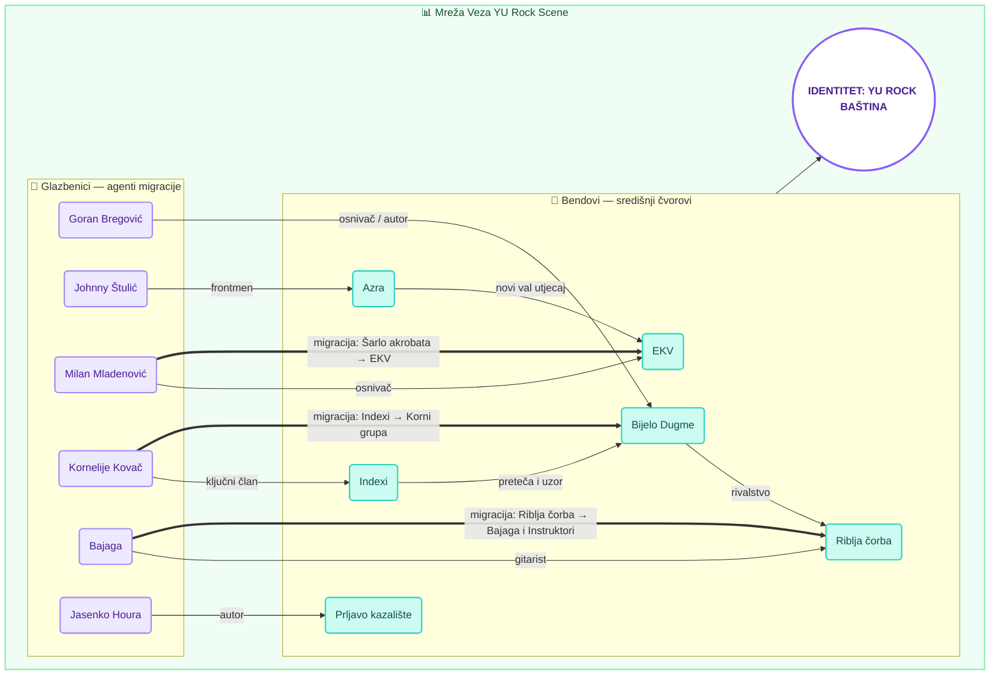

# Mreža Glazbenog Identiteta: Analiza Migracije Glazbenika i Veza Između Bendova Jugoslavenske Rock Scene

**Autor:** Lana Ćus 
**Datum:** 18. svibnja 2026.  
**Institucija:** Filozofski fakultet u Rijeci  
**Kolegij:** Istraživanje društvenih mreža

---

### Sažetak (Abstract)

Ovaj rad opisuje razvoj i analizu aplikacije "YU Rock Mreža", interaktivnog alata za vizualizaciju podataka usmjerenog na povijest rock glazbe u Socijalističkoj Federativnoj Republici Jugoslaviji. Koristeći tehnologiju usmjerenog grafa (force-directed graph) pokretanu D3.js bibliotekom unutar React radnog okvira, aplikacija mapira relacije između glazbenika, bendova i diskografskih izdanja s fokusom na migraciju glazbenika između sastava. Rezultati ukazuju na migraciju kao primarni strukturalni mehanizam koji je povezivao regionalno odvojene scene u jedinstven kulturni ekosustav.

**Ključne riječi:** digitalna humanistika, mrežna analiza, YU rock, migracija glazbenika, D3.js, vizualizacija podataka.

---

### 1. Uvod

Jugoslavenska rock scena (1970-ih i 1980-ih) karakterizirana je visokom razinom mobilnosti glazbenika između različitih sastava i intenzivnom kolaboracijom između regionalnih scena — sarajevske, beogradske, zagrebačke i ljubljanske. Cilj ovog projekta bio je razviti softversko rješenje koje omogućuje istraživanje tih veza, s posebnim fokusom na migraciju glazbenika kao kohezivni mehanizam scene, pretvarajući statične povijesne podatke u dinamički, analitički alat.

### 2. Metodologija

U razvoju aplikacije i analizi podataka primijenjen je iterativni model razvoja softvera kombiniran s metodama mrežne analize.

#### 2.1 Tehnološki Stog (Tech Stack)
- **Frontend:** React 19 pruža reaktivno sučelje i upravljanje stanjima odabira čvorova.
- **Vizualizacija:** D3.js (Data-Driven Documents) implementira fizikalnu simulaciju (force simulation) koja automatski raspoređuje čvorove na temelju njihove povezanosti.
- **Stiliziranje:** Tailwind CSS koristi se za implementaciju korisničkog sučelja koje kombinira čitljivost s vizualnom koherentnošću podataka.
- **Animacije:** Motion (framer-motion) osigurava plynske prijelaze prilikom otvaranja detaljnih panela čvorova.

#### 2.2 Modeliranje Podataka
Podaci su strukturirani u JSON formatu (Graph Theory Model) s dva osnovna skupa:
1. **Nodes (Čvorovi):** Entiteti — Glazbenik, Bend, Album, Pjesma — s metapodacima kao što su uloge, instrumenti, grad porijekla i povijesni značaj.
2. **Links (Poveznice):** Relacije tipa *članstvo*, *migracija*, *suradnja*, *rivalstvo* ili *izdavanje*, svaka s opisom koji specificira smjer i prirodu veze.

### 3. Arhitektura Aplikacije

Sustav je podijeljen u tri glavne komponente:
- **NetworkGraph:** Jezgra sustava koja renderira SVG platno. Koristi force-directed algoritme za automatsko raspoređivanje čvorova prema gustoći veza, čime se vizualno naglašavaju čvorišta s visokim stupnjem (npr. Bijelo Dugme, EKV).
- **DetailPanel:** Kontekstualni prozor koji se aktivira selekcijom čvora i prikazuje detaljne metapodatke entiteta koristeći asinkrono filtriranje relacija.
- **Data Engine:** Centralni repozitorij (`data.ts`) koji služi kao jedini izvor podataka (single source of truth) za sve komponente sustava.

### 4. Rezultati

Implementacija vizualizacije potvrđuje da grafički prikaz centralnih čvorova (poput Bijelog Dugmeta ili Azre) jasno demonstrira njihovu ulogu kao gravitacijskih čvorišta scene. Analiza migracijskih veza otkriva dva strukturalna tipa glazbenika: **osovinske** (osnivači koji ostaju konstanta benda, npr. Goran Bregović, Johnny Štulić, Jasenko Houra) i **migracijske** (glazbenici koji prenose ideje između bendova, npr. Kornelije Kovač: Indexi → Korni grupa; Milan Mladenović: Šarlo akrobata → EKV; Bajaga: Riblja čorba → Bajaga i Instruktori).

Donji dijagram prikazuje ključne čvorove i veze analizirane mreže, koristeći kolorističko kodiranje — teal za bendove kao središnje čvorove, ljubičasto za glazbenike — osiguravajući preglednost i jasnoću strukturalnih relacija:

Korištenje različitih boja i debljina linija za kodiranje tipa veze (članstvo, migracija, rivalstvo) smanjuje kognitivno opterećenje korisnika pri interpretaciji složenih povijesnih podataka. Šarlo akrobata, unatoč kratkom vijeku (1980.–1981.), bilježi visok broj izlaznih veza — što potvrđuje da bend s jasnom estetskom koherentnošću može imati znatan utjecaj na strukturu mreže. YU Rock Misija (1985.) funkcionira kao empirijska potvrda gustoće mreže: u jednom projektu konvergiraju čvorovi iz svih regionalnih scena.

### 5. Zaključak

"YU Rock Mreža" potvrđuje da je migracija glazbenika između bendova bila primarni strukturalni mehanizam koji je povezivao jugoslavensku rock scenu. Grafički prikaz mreže pokazuje da su regionalne razlike između sarajevske, beogradske, zagrebačke i ljubljanske scene bile osnova za razmjenu ideja. Arhitektura sustava dopušta skalabilnost na veći broj čvorova. Budući rad trebao bi se usmjeriti na integraciju audio-vizualnih medija i vremensku animaciju migracija po desetljećima.

---

### Literatura (References)

- Janjatović, P. (2007). *Ex YU rock enciklopedija 1960–2006*. Samostalno izdanje.
- Bostock, M., Ogievetsky, V., & Heer, J. (2011). D3: Data-Driven Documents. *IEEE Transactions on Visualization and Computer Graphics*.
- Scott, J. (2017). *Social Network Analysis*. SAGE Publications.
- Vesić, D. (2014). *Šta bi dao da si na mom mjestu*. Laguna.
- YU Rock Mreža: Interaktivni Arhiv (Digitalni artefakt, 2026).
